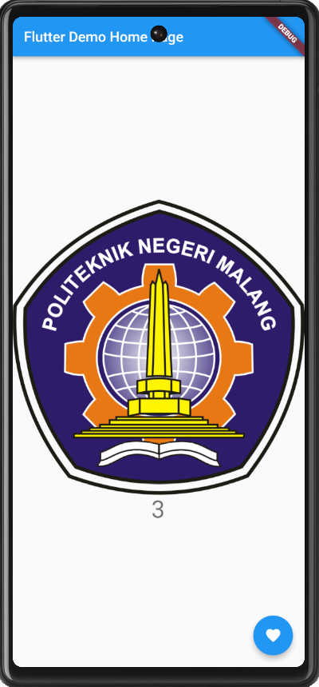
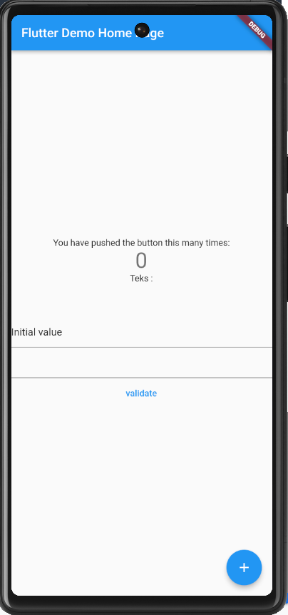
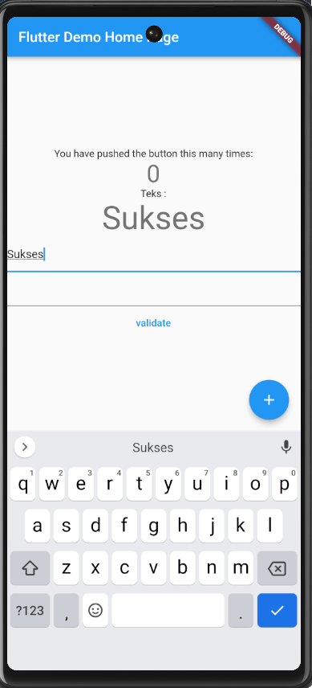
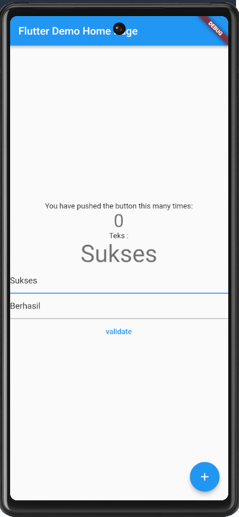
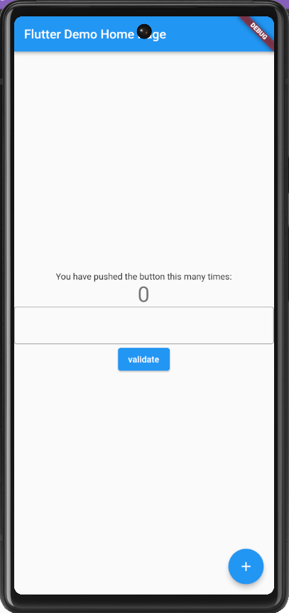
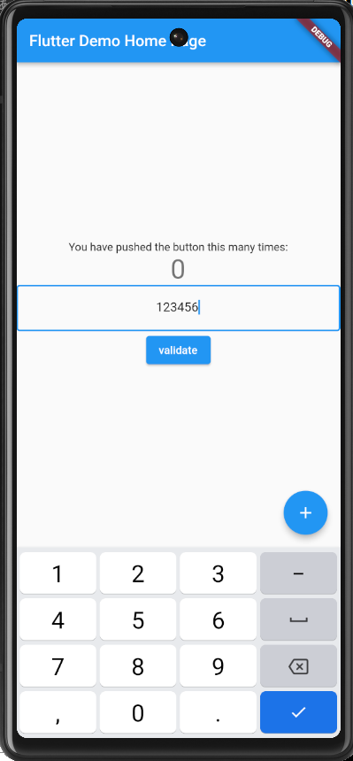

# flutter_fundamental_3

A new Flutter project.

## Getting Started
Praktikum 1

Penjelasan:

onTap: Mengetuk 1 kali pada gambar dan anggka akan bertambah 1 angka

onDoubleTap: Mengetuk sebanyak 2 kali pada gambar dan angka akan bertambah 1 angka

onLongPress: Mengetuk 2 kali dan ketukan ke-2 ditahan lebih lama pada gambar dan angka akan bertambah 1 angka

Praktikum 2

Praktikum 3

Silakan coba isi form field dengan mengetikkan huruf dan angka. Apa yang terjadi ? Jelaskan dalam laporan praktikum Anda!

Hasil tampilan diatas hanya bisa diisi dengan angka saja karena terdapat kode  "FilteringTextInputFormatter.allow(RegExp("[0-9]"))" yang berfungsi untuk membatasi inputan hanya dapat berisi angka.

---------------------------

This project is a starting point for a Flutter application.

A few resources to get you started if this is your first Flutter project:

- [Lab: Write your first Flutter app](https://docs.flutter.dev/get-started/codelab)
- [Cookbook: Useful Flutter samples](https://docs.flutter.dev/cookbook)

For help getting started with Flutter development, view the
[online documentation](https://docs.flutter.dev/), which offers tutorials,
samples, guidance on mobile development, and a full API reference.
